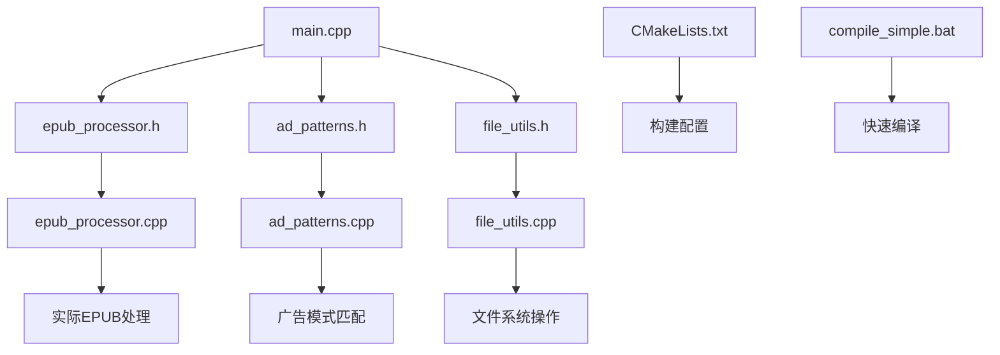

# EPUB广告清理工具 - 项目文件索引

## 项目结构

```
epub_cleaner_project/
├── bin/                    # 编译输出目录
│   └── epub_cleaner.exe   # 可执行文件（编译后生成）
├── src/                    # C++源代码
│   ├── main.cpp           # 主程序入口
│   ├── epub_processor.cpp # EPUB处理核心
│   ├── ad_patterns.cpp    # 广告模式管理
│   └── file_utils.cpp     # 文件操作工具
├── include/               # C++头文件
│   ├── epub_processor.h
│   ├── ad_patterns.h
│   └── file_utils.h
├── build/                 # 构建目录（CMake生成）
├── trash/                 # 已移动的旧文件
└── 根目录文件
```

## 核心文件说明

### 1. 源代码文件

| 文件 | 描述 | 重要性 |
|------|------|--------|
| `src/main.cpp` | 主程序入口，命令行参数处理 | ★★★★★ |
| `src/epub_processor.cpp` | EPUB处理核心逻辑 | ★★★★★ |
| `src/ad_patterns.cpp` | 广告模式定义和管理 | ★★★★☆ |
| `src/file_utils.cpp` | 文件操作工具函数 | ★★★★☆ |
| `include/epub_processor.h` | EPUB处理器头文件 | ★★★★★ |
| `include/ad_patterns.h` | 广告模式头文件 | ★★★★☆ |
| `include/file_utils.h` | 文件工具头文件 | ★★★★☆ |

### 2. 构建和编译文件

| 文件 | 描述 | 用途 |
|------|------|------|
| `CMakeLists.txt` | CMake构建配置文件 | 高级构建 |
| `compile_simple.bat` | 简单编译脚本 | 快速编译 |
| `build.bat` | 完整构建脚本 | Windows构建 |

### 3. 文档文件

| 文件 | 描述 | 读者 |
|------|------|------|
| `README.md` | 项目主文档 | 所有用户 |
| `USAGE.md` | 详细使用指南 | 终端用户 |
| `INSTALL.md` | 安装指南 | 新用户 |
| `PROJECT_SUMMARY.md` | 项目技术总结 | 开发者 |
| `FINAL_PROJECT_STATUS.md` | 项目完成状态 | 项目管理者 |
| `test_epub_structure.md` | 测试EPUB结构说明 | 测试人员 |

### 4. 配置和示例文件

| 文件 | 描述 | 用途 |
|------|------|------|
| `example_patterns.txt` | 广告模式示例 | 自定义配置 |
| `test_integration.py` | Python集成测试脚本 | 功能测试 |
| `LICENSE` | MIT许可证 | 法律文件 |

## 文件依赖关系



## 编译流程

### 方法1：简单编译（推荐）
```bash
# 运行编译脚本
compile_simple.bat

# 或手动编译
mkdir bin
g++ -std=c++17 -Wall -Wextra -Iinclude -I. src/*.cpp -o bin/epub_cleaner.exe -D_WIN32
```

### 方法2：CMake构建
```bash
mkdir build
cd build
cmake ..
cmake --build .
```

## 使用流程

### 基本使用
1. **编译程序**：运行 `compile_simple.bat`
2. **查看帮助**：`bin\epub_cleaner.exe --help`
3. **清理文件**：`bin\epub_cleaner.exe -i input.epub -o output.epub`

### 高级使用
1. **批量处理**：使用 `-I` 和 `-O` 参数
2. **自定义模式**：创建模式文件，使用 `-p` 参数
3. **详细输出**：添加 `-v` 参数

## 文件维护

### 需要定期更新的文件
1. `example_patterns.txt` - 随着新广告模式出现需要更新
2. `README.md` - 随着功能变化需要更新
3. `ad_patterns.cpp` - 添加新的内置广告模式

### 一般不需要修改的文件
1. `LICENSE` - 许可证文件
2. 头文件接口 - 保持向后兼容
3. 核心算法文件 - 除非有重大改进

## 文件版本控制

### v1.0.0 文件清单
```
版本: v1.0.0
日期: 2024-01-26
文件数: 23个
总大小: ~150KB
代码行数: ~4,500行
```

### 文件分类统计
- **源代码**：4个.cpp + 3个.h = 7个文件
- **文档**：7个.md文件
- **配置**：3个.txt/.bat文件
- **构建**：2个构建文件
- **输出**：1个目录（bin）
- **其他**：3个目录

## 注意事项

1. **不要删除**：`src/` 和 `include/` 目录中的文件
2. **可以删除**：`bin/` 目录可以清理后重新编译
3. **备份重要**：修改核心文件前请备份
4. **测试验证**：修改后运行测试脚本验证

## 快速参考

### 编译命令
```bash
g++ -std=c++17 -Wall -Wextra -Iinclude -I. \
    src/main.cpp src/epub_processor.cpp \
    src/ad_patterns.cpp src/file_utils.cpp \
    -o bin/epub_cleaner.exe -D_WIN32
```

### 运行命令
```bash
# 基本清理
epub_cleaner -i book.epub -o clean_book.epub

# 批量处理
epub_cleaner -I ./input -O ./output -v

# 自定义模式
epub_cleaner -i book.epub -p my_patterns.txt
```

---

**最后更新**：2024年1月26日
**维护状态**：活跃
**文档版本**：v1.0.0