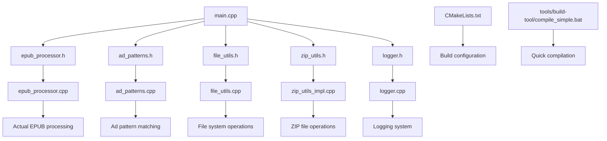

# EPUB Ad Cleaner - Project File Index (v1.1.0)

## Project Structure

```
epub_cleaner_project/
├── docs/                    # All documentation (English/Chinese)
│   ├── README.md           # Complete English documentation
│   ├── README_ZH.md        # Complete Chinese documentation
│   ├── USAGE.md            # Usage guide (English)
│   ├── USAGE_ZH.md         # Usage guide (Chinese)
│   ├── INSTALL.md          # Installation guide (English)
│   ├── INSTALL_ZH.md       # Installation guide (Chinese)
│   ├── PROJECT_SUMMARY.md  # Technical project summary (English)
│   ├── PROJECT_SUMMARY_ZH.md # Technical project summary (Chinese)
│   ├── FINAL_PROJECT_STATUS.md # Project completion status (English)
│   ├── FINAL_PROJECT_STATUS_ZH.md # Project completion status (Chinese)
│   ├── INDEX.md            # This file
│   └── TEST_EPUB_STRUCTURE.md # Test documentation (English)
├── src/                    # C++ source code
│   ├── main.cpp           # Main program entry
│   ├── epub_processor.cpp # EPUB processing core
│   ├── ad_patterns.cpp    # Ad pattern management
│   ├── file_utils.cpp     # File operation utilities
│   ├── zip_utils_impl.cpp # ZIP file processing implementation
│   ├── zlib_utils.cpp     # zlib compression utilities
│   └── logger.cpp         # Logging system
├── include/               # C++ header files
│   ├── epub_processor.h
│   ├── ad_patterns.h
│   ├── file_utils.h
│   ├── zip_utils.h
│   └── logger.h
├── tools/                 # Tool scripts
│   ├── build-tool/       # Build tools
│   │   ├── build.bat     # Full build script
│   │   └── compile_simple.bat # Simple compilation script
│   └── test/             # Testing tools
│       ├── test_main.cpp # Unit tests
│       └── test_refactored.bat # Refactored version tests
├── bin/                   # Compiled output directory
├── build/                 # CMake build directory
├── .gitignore            # Git ignore file
├── CMakeLists.txt        # CMake build configuration
├── example_patterns.txt  # Ad pattern examples
└── LICENSE               # MIT License
```

## Core File Descriptions

### 1. Source Code Files

| File | Description | Importance |
|------|-------------|------------|
| `src/main.cpp` | Main program entry, command line argument processing | ★★★★★ |
| `src/epub_processor.cpp` | EPUB processing core logic | ★★★★★ |
| `src/ad_patterns.cpp` | Ad pattern definition and management | ★★★★☆ |
| `src/file_utils.cpp` | File operation utility functions | ★★★★☆ |
| `src/zip_utils_impl.cpp` | ZIP file processing implementation (new in v1.1.0) | ★★★★☆ |
| `src/logger.cpp` | Logging system (new in v1.1.0) | ★★★☆☆ |
| `src/zlib_utils.cpp` | zlib compression utilities (new in v1.1.0) | ★★★☆☆ |

### 2. Header Files

| File | Description | Importance |
|------|-------------|------------|
| `include/epub_processor.h` | EPUB processor header | ★★★★★ |
| `include/ad_patterns.h` | Ad pattern header | ★★★★☆ |
| `include/file_utils.h` | File utility header | ★★★★☆ |
| `include/zip_utils.h` | ZIP utility header (new in v1.1.0) | ★★★★☆ |
| `include/logger.h` | Logging system header (new in v1.1.0) | ★★★☆☆ |

### 3. Build and Compilation Files

| File | Description | Purpose |
|------|-------------|---------|
| `CMakeLists.txt` | CMake build configuration file | Advanced build |
| `tools/build-tool/compile_simple.bat` | Simple compilation script | Quick compilation |
| `tools/build-tool/build.bat` | Full build script | Windows build |

### 4. Documentation Files (Bilingual)

| File | Description | Language |
|------|-------------|----------|
| `README.md` | Project main documentation | English |
| `docs/README.md` | Complete project documentation | English |
| `docs/README_ZH.md` | 完整项目文档 | Chinese |
| `docs/USAGE.md` | Detailed usage guide | English |
| `docs/USAGE_ZH.md` | 详细使用指南 | Chinese |
| `docs/INSTALL.md` | Installation instructions | English |
| `docs/INSTALL_ZH.md` | 安装说明 | Chinese |
| `docs/PROJECT_SUMMARY.md` | Technical project summary | English |
| `docs/PROJECT_SUMMARY_ZH.md` | 项目技术总结 | Chinese |
| `docs/FINAL_PROJECT_STATUS.md` | Project completion status | English |
| `docs/FINAL_PROJECT_STATUS_ZH.md` | 项目完成状态 | Chinese |
| `docs/INDEX.md` | This file | English |

### 5. Configuration and Example Files

| File | Description | Purpose |
|------|-------------|---------|
| `example_patterns.txt` | Ad pattern examples | Custom configuration |
| `tools/test/test_main.cpp` | Unit tests | Function testing |
| `tools/test/test_refactored.bat` | Refactored version tests | Integration testing |
| `LICENSE` | MIT License | Legal document |

## File Dependencies



## Compilation Process

### Method 1: Simple Compilation (Recommended)
```bash
# Run compilation script
tools/build-tool/compile_simple.bat

# Or compile manually
mkdir bin
g++ -std=c++17 -Wall -Wextra -Iinclude -I. src/*.cpp -o bin/epub_cleaner.exe -D_WIN32
```

### Method 2: CMake Build
```bash
mkdir build
cd build
cmake ..
cmake --build .
```

## Usage Process

### Basic Usage
1. **Compile program**: Run `tools/build-tool/compile_simple.bat`
2. **View help**: `bin\epub_cleaner.exe --help`
3. **Clean file**: `bin\epub_cleaner.exe -i input.epub -o output.epub`

### Advanced Usage
1. **Batch processing**: Use `-I` and `-O` parameters
2. **Custom patterns**: Create pattern file, use `-p` parameter
3. **Verbose output**: Add `-v` parameter
4. **Debug mode**: Add `-d` parameter
5. **List patterns**: Use `--list-patterns` parameter

## File Maintenance

### Files that need regular updates
1. `example_patterns.txt` - Update as new ad patterns appear
2. `docs/USAGE.md` and `docs/USAGE_ZH.md` - Update as features change
3. `src/ad_patterns.cpp` - Add new built-in ad patterns

### Files that generally don't need modification
1. `LICENSE` - License file
2. Header file interfaces - Maintain backward compatibility
3. Core algorithm files - Unless major improvements

## File Version Control

### v1.1.0 File List
```
Version: v1.1.0
Date: 2024-01-26
Total files: 32
Total size: ~180KB
Lines of code: ~4,800 lines
```

### File Category Statistics
- **Source code**: 7 .cpp + 5 .h = 12 files
- **Documentation**: 12 .md files (6 English + 6 Chinese)
- **Configuration**: 4 .txt/.bat files
- **Build**: 3 build files
- **Output**: 1 directory (bin)
- **Other**: 4 directories

## Important Notes

1. **Do not delete**: Files in `src/` and `include/` directories
2. **Can delete**: `bin/` directory can be cleaned and recompiled
3. **Backup important**: Backup before modifying core files
4. **Test verification**: Run test scripts after modifications
5. **Bilingual documentation**: Keep English and Chinese versions synchronized

## Quick Reference

### Compilation Commands
```bash
g++ -std=c++17 -Wall -Wextra -Iinclude -I. \
    src/main.cpp src/epub_processor.cpp src/ad_patterns.cpp \
    src/file_utils.cpp src/zip_utils_impl.cpp src/logger.cpp \
    -o bin/epub_cleaner.exe -D_WIN32
```

### Running Commands
```bash
# Basic cleaning
epub_cleaner -i book.epub -o clean_book.epub

# Batch processing
epub_cleaner -I ./input -O ./output -v

# Custom patterns
epub_cleaner -i book.epub -p my_patterns.txt

# Debug mode
epub_cleaner -i book.epub -o clean_book.epub -d

# List built-in patterns
epub_cleaner --list-patterns
```

---

**Last Updated**: January 26, 2024
**Maintenance Status**: Active
**Document Version**: v1.1.0
**Build Tools Location**: tools/build-tool/
**Test Tools Location**: tools/test/
**Documentation Status**: ✅ Bilingual (English/Chinese)